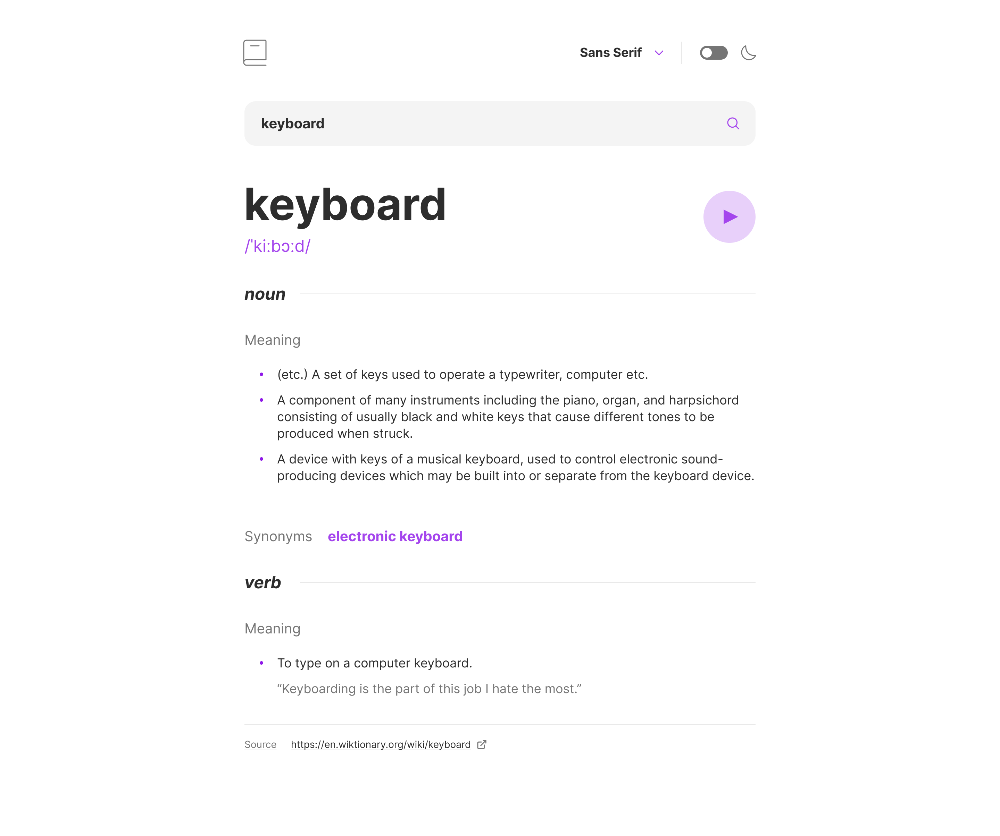

# Frontend Mentor - Dictionary Web App Solution

This is my solution to the [Dictionary web app challenge on Frontend Mentor](https://www.frontendmentor.io/challenges/dictionary-web-app-h5wwnyuKFL). The goal was to build a responsive, accessible dictionary app using a public API, complete with light/dark mode and font-switching functionality.

---

## Table of Contents

- [Overview](#overview)

  - [The Challenge](#the-challenge)
  - [Screenshot](#screenshot)
  - [Links](#links)

- [My Process](#my-process)

  - [Built With](#built-with)
  - [What I Learned](#what-i-learned)
  - [Continued Development](#continued-development)
  - [Useful Resources](#useful-resources)

- [Author](#author)

---

## Overview

### The Challenge

Users should be able to:

- Search for words using the input field
- View definitions, examples, phonetics, and audio pronunciation
- See a validation error when submitting an empty input
- Switch between Sans Serif, Serif, and Mono fonts
- Toggle between light and dark modes
- Have their selected font and theme persist across page reloads
- View the interface responsively across devices
- See hover and focus states for interactive elements

### Screenshot



---

### Links

- **Solution URL:** [Frontend Mentor](https://www.frontendmentor.io/solutions/dictionary-app-react-tailwind-darkmode-font-switcher-xyz)
- **Live Site URL:** [Live Demo](https://your-live-site-url.com)

---

## My Process

### Built With

- Semantic HTML5
- Tailwind CSS (with custom fonts and dark mode support)
- React (Functional Components + Hooks)
- React Context API for global state management
- LocalStorage for theme and font persistence
- Free Dictionary API for data

---

### What I Learned

- How to manage global UI state like theme and font using React Context
- How to persist user preferences using `localStorage`
- How to dynamically apply Tailwind `font-*` and `dark:` classes
- How to modularize a React app using smart/dumb components

```js
function handleFont(fontOption) {
  setSelectedFont(fontOption);
  document.body.classList.remove("sans-serif", "serif", "mono");
  document.body.classList.add(fontOption);
  localStorage.setItem("preferredFont", fontOption);
}
```

```js
useEffect(() => {
  const storedFont = localStorage.getItem("preferredFont");
  if (storedFont) {
    setSelectedFont(storedFont);
    document.body.classList.add(storedFont);
  }
}, []);
```

---

### Continued Development

I’d like to improve this project by:

- Adding a search history feature
- Caching definitions to reduce API calls
- Supporting language switching for international dictionaries
- Using TypeScript for better type safety

---

### Useful Resources

- [The Free Dictionary API](https://dictionaryapi.dev/) – The public API used for fetching word data
- [Tailwind Docs – Dark Mode](https://tailwindcss.com/docs/dark-mode) – Helpful for setting up theme switching
- [MDN – localStorage](https://developer.mozilla.org/en-US/docs/Web/API/Window/localStorage) – Essential for persisting font/theme
- [Frontend Mentor Discord](https://discord.gg/frontendmentor) – For community support and tips

---

## Author

- Website – [rohantgeorge.ca](https://www.rohantgeorge.ca/)
- Frontend Mentor – [@rohantgeorge](https://www.frontendmentor.io/profile/rohantgeorge)
- Twitter – [@rohantgeorge05](https://twitter.com/rohantgeorge05)
